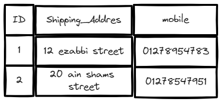
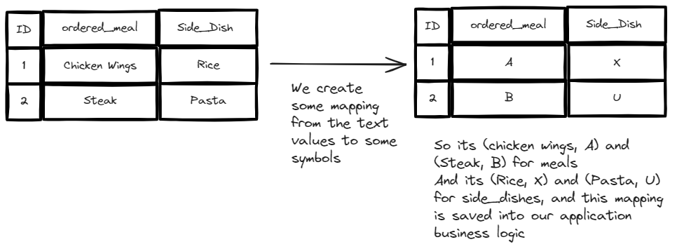
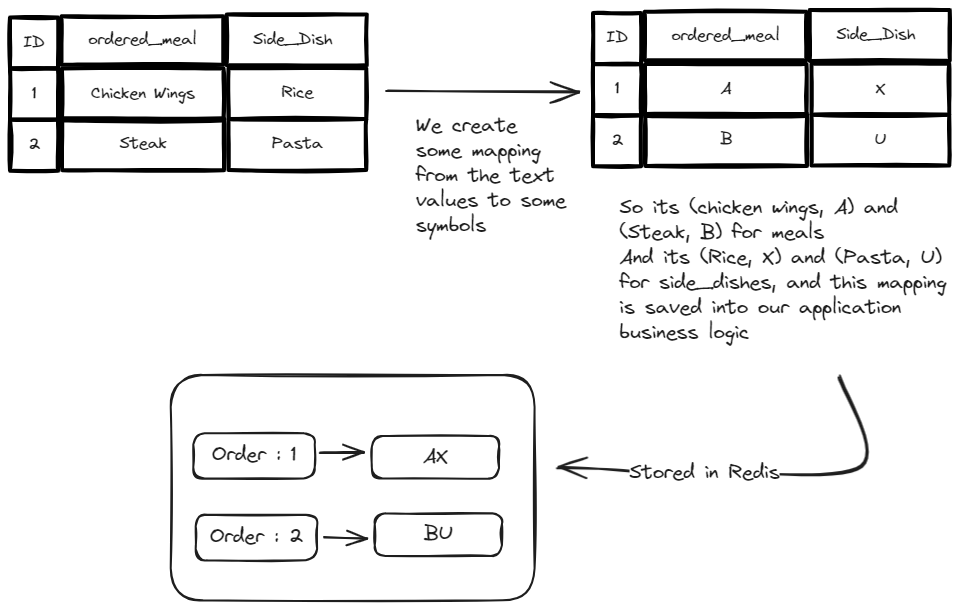

# redis-go
In this repo I will document all I know about how to use redis proffessionaly in Golang applications

# To start redis using Docker 
- pull the image from docker hub
```shell
docker pull redis 
```
- run the containe and expose a port
```shell
docker run --name redisgo -p 6379:6379 redis
```
- to access the shell inside the running instance 
```shell
docker exec -it redisgo redis-cli
```
# Just keep thess notes in your mind for future notes 
- Redis is synchronously and single threaded by nature.
- If multiple commands came to redis in the same time, redis will process them synchronously.
- In Redis we figure out first what are the required usecases and queries we can use redis to solve, and then we structure our data and store the data in redis. 

# How to `SET strings` into redis
```powershell
SET key value \
[Options to specify when the value will expire] \
[option to specify to set this key if only its not set before or set it only if it does already exists] \
[option to ask redis to return the old value stored in this key]
``` 

Examples:
- we can get the previous stored value before we override it
```powershell
127.0.0.1:6379> SET username fady
OK
127.0.0.1:6379> SET username marwan GET
"fady"
127.0.0.1:6379>
```      

- we can set the key only if this key exists before
- we can do this using the `XX` option 
```powershell
127.0.0.1:6379> GET age
(nil)
127.0.0.1:6379> SET age 25 XX
(nil)
127.0.0.1:6379> SET age 25
OK
127.0.0.1:6379> SET age 24 XX
OK
```

- now we can specify that we need to set the key if its doesn't exists in our database before
- we can do this using the `NX` option

```powershell
127.0.0.1:6379> GET age
"24" # so the age exists 
127.0.0.1:6379> SET age 23 NX
(nil) # we couldn't set it
127.0.0.1:6379>
```

# To delete key-value pair from redis (Whatever the type)
```powershell
DEL [key]
```

# How Redis range queries can solve some performence issues in your application 
- Assume we have this table structure in our relational database, and we have millions of orders
- required queries are : <br>
    1. Fetch one row (order) to view one or more fields of this order (select shipping_addr / select *)
    2. Update one or more properties of a specific order 
    3. Fetch all props of multiple orders 
    4. Insert multiple orders (Rows)
    <br>


- Solution : <br>
    -   Since that we have specific values for each field, for example we will have 20 meals so the possible values in the orderd_meal column will be 1 of 20 values, and same for the side_Dish.
    - we will create some mapping between the known range of values to some numeric values or characters or whatever is reasonable for our usecase
    
    - After we got this encoded table (mapping), we can store some light weight table in redis so we can access and manipulate our data more fast.
    
    - Now lets solve the queries in redis-style .. <br>
        1. Fetch one row (order) to view one or more fields of this order (select shipping_addr / select *)
        ```powershell
        GETRANGE "order:1" 0 0 # this will returns the characters from 0 to 0 which is the first character, and now in our application we can map the returned response to the actuall values

        GETRANGE "order:2" 0 1 # return all fields
        ```
        2. Update one or more properties of a specific order 
        ```powershell
        SETRANGE "order:1" 0 B # This will start override the value from index zero, and replcae only one character because we specified only one character, by updating from A to B so we updated the meal from Chicken to Steak

        GETRANGE "order:2" 0 BU # update all fields (meal and side_dish)
        ```
        3. Fetch all props of multiple orders 
        ```powershell
        MGET "order:1" "order:2" "order:3" # returl all fields of these three items
        ```
        4. Insert multiple orders (Rows)
        ```powershell
        MSET "order:3" AU "order:4" BX
        ```

# Working with numbers in Redis 
we use `SET` and `GET` for numbers too, but there are some additional commands, and if you need to do the usecase that these commands do, please don't use two round-trip SET and GET operations to perform the usecase, becuase these commands are here for a reason, and the reason is they interact/get use of the synchronous nature of redis.
```powershell
127.0.0.1:6379> SET age 20
OK
127.0.0.1:6379> INCR age
(integer) 21
127.0.0.1:6379> INCRBY age 10
(integer) 31
127.0.0.1:6379>
```

# Working with Hashes (objects) in Redis 
hashes in redis are just objects, redis store hashes as the following : <br>
`key : { key1 : val1, key2 : val2, .... }`

```powershell
127.0.0.1:6379> HSET users username fady password pass
(integer) 2
# to retreive specific field
127.0.0.1:6379> HGET users username
"fady"
127.0.0.1:6379> HGET users password
"pass"
# to retreive all fields, redis will return an array [key val key val ....]
127.0.0.1:6379> HGETALL users
1) "username"
2) "fady"
3) "password"
4) "pass"
127.0.0.1:6379>
```
- to check if specific key is stored in specific hash in redis use `HEXISTS` 
```powershell
127.0.0.1:6379> HEXISTS users username
(integer) 1
127.0.0.1:6379>
```

- To delete specific field of an existing hash use `HDEL`
```powershell
127.0.0.1:6379> HGETALL users
1) "username"
2) "fady"
3) "password"
4) "pass"
127.0.0.1:6379> DEL users
(integer) 1
127.0.0.1:6379> HGETALL users
(empty array)
127.0.0.1:6379> HSET users username fady password pass
(integer) 2
127.0.0.1:6379> HDEL users username
(integer) 1
127.0.0.1:6379> HGETALL users
1) "password"
2) "pass"
127.0.0.1:6379>
```

- we can also retreive the keys and values sperately 
```powershell
127.0.0.1:6379> HSET companies company halan location "6'th October"
(integer) 2
127.0.0.1:6379> HVALS companies
1) "halan"
2) "6'th October"
127.0.0.1:6379> HKEYS companies
1) "company"
2) "location"
127.0.0.1:6379>
```

# Working with Go 

### Wierd behaviour of hashes with redis `HGETALL` : 

```go
redis := connect()

err := redis.HSet("user:100", "username", "fadyGamil").Err()
if err != nil {
    log.Fatalf("error setting user data : %v", err)
}

res, err := redis.HGet("user:100", "username").Result()
if err != nil {
    log.Fatalf("error getting username : %v", err)
}
log.Printf("username is : %v\n", res)

// but if we used HGETALL we will get an unexpected response, which will be not an error, it will be an empty map[] in Go and an empty object in javascript
response, err := redis.HGetAll("user:102").Result()
if err != nil {
    log.Fatalf("error getting all fields : %v", err)
}
log.Printf("all fields of user:102 : %v \n", response)

// if we try to get some key that doesn't exists, redis will return nil (the expected behaviour)
res, err = redis.HGet("user:101", "username").Result()
if err != nil {
    log.Fatalf("error getting username : %v", err)
}
log.Printf("username is : %v\n", res)

```

```powershell
➜ redisgo git:(main) ✗ go run .\main.go
2023/12/30 09:25:24 username is : fadyGamil
2023/12/30 09:25:24 all fields of user:102 : map[]     
2023/12/30 09:25:24 error getting username : redis: nil
```

to handle this behviour so we always perform the right actions based on the returned result we should check the length of the returned map if its zero, so the key isn't stored before, if its not zero, we got the value and we could return the data to users easily
```go
redis := connect()

err := redis.HSet("user:100", "username", "fadyGamil").Err()
if err != nil {
    log.Fatalf("error setting user data : %v", err)
}

res, err := redis.HGet("user:100", "username").Result()
if err != nil {
    log.Fatalf("error getting username : %v", err)
}
log.Printf("username is : %v\n", res)

// but if we used HGETALL we will get an unexpected response, which will be not an error, it will be an empty map[] in Go and an empty object in javascript
response, err := redis.HGetAll("user:102").Result()
if err != nil {
    log.Fatalf("error getting all fields : %v", err)
}
// we should check the data first if its an empty map or not
if len(response) == 0 {
    log.Println("user:102 doesn't exists")
} else {
    log.Printf("all fields of user:102 : %v \n", response)
}

// if we try to get some key that doesn't exists, redis will return nil (the expected behaviour)
res, err = redis.HGet("user:101", "username").Result()
if err != nil {
    log.Fatalf("error getting username : %v", err)
}
log.Printf("username is : %v\n", res)
```

```powershell
➜ redisgo git:(main) ✗ go run .\main.go
2023/12/30 09:31:58 username is : fadyGamil
2023/12/30 09:31:58 user:102 doesn't exists
2023/12/30 09:31:58 error getting username : redis: nil
```