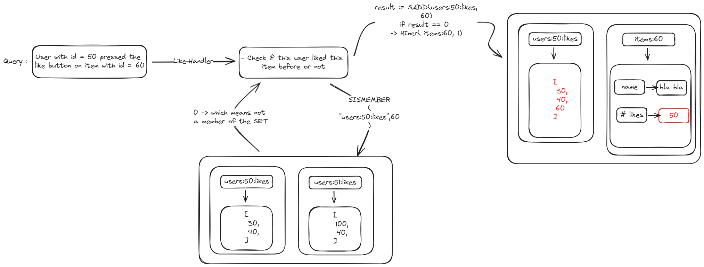

# redis-go
In this repo I will document all I know about how to use redis proffessionaly in Golang applications

# To start redis using Docker 
- pull the image from docker hub
```shell
docker pull redis 
```
- run the containe and expose a port
```shell
docker run --name redisgo -p 6379:6379 redis
```
- to access the shell inside the running instance 
```shell
docker exec -it redisgo redis-cli
```
# Just keep thess notes in your mind for future notes 
- Redis is synchronously and single threaded by nature.
- If multiple commands came to redis in the same time, redis will process them synchronously.
- In Redis we figure out first what are the required usecases and queries we can use redis to solve, and then we structure our data and store the data in redis. 

# How to `SET strings` into redis
```powershell
SET key value \
[Options to specify when the value will expire] \
[option to specify to set this key if only its not set before or set it only if it does already exists] \
[option to ask redis to return the old value stored in this key]
``` 

Examples:
- we can get the previous stored value before we override it
```powershell
127.0.0.1:6379> SET username fady
OK
127.0.0.1:6379> SET username marwan GET
"fady"
127.0.0.1:6379>
```      

- we can set the key only if this key exists before
- we can do this using the `XX` option 
```powershell
127.0.0.1:6379> GET age
(nil)
127.0.0.1:6379> SET age 25 XX
(nil)
127.0.0.1:6379> SET age 25
OK
127.0.0.1:6379> SET age 24 XX
OK
```

- now we can specify that we need to set the key if its doesn't exists in our database before
- we can do this using the `NX` option

```powershell
127.0.0.1:6379> GET age
"24" # so the age exists 
127.0.0.1:6379> SET age 23 NX
(nil) # we couldn't set it
127.0.0.1:6379>
```

# To delete key-value pair from redis (Whatever the type)
```powershell
DEL [key]
```

# How Redis range queries can solve some performence issues in your application 
- Assume we have this table structure in our relational database, and we have millions of orders
- required queries are : <br>
    1. Fetch one row (order) to view one or more fields of this order (select shipping_addr / select *)
    2. Update one or more properties of a specific order 
    3. Fetch all props of multiple orders 
    4. Insert multiple orders (Rows)
    <br>


- Solution : <br>
    -   Since that we have specific values for each field, for example we will have 20 meals so the possible values in the orderd_meal column will be 1 of 20 values, and same for the side_Dish.
    - we will create some mapping between the known range of values to some numeric values or characters or whatever is reasonable for our usecase
    
    - After we got this encoded table (mapping), we can store some light weight table in redis so we can access and manipulate our data more fast.
    
    - Now lets solve the queries in redis-style .. <br>
        1. Fetch one row (order) to view one or more fields of this order (select shipping_addr / select *)
        ```powershell
        GETRANGE "order:1" 0 0 # this will returns the characters from 0 to 0 which is the first character, and now in our application we can map the returned response to the actuall values

        GETRANGE "order:2" 0 1 # return all fields
        ```
        2. Update one or more properties of a specific order 
        ```powershell
        SETRANGE "order:1" 0 B # This will start override the value from index zero, and replcae only one character because we specified only one character, by updating from A to B so we updated the meal from Chicken to Steak

        GETRANGE "order:2" 0 BU # update all fields (meal and side_dish)
        ```
        3. Fetch all props of multiple orders 
        ```powershell
        MGET "order:1" "order:2" "order:3" # returl all fields of these three items
        ```
        4. Insert multiple orders (Rows)
        ```powershell
        MSET "order:3" AU "order:4" BX
        ```

# Working with numbers in Redis 
we use `SET` and `GET` for numbers too, but there are some additional commands, and if you need to do the usecase that these commands do, please don't use two round-trip SET and GET operations to perform the usecase, becuase these commands are here for a reason, and the reason is they interact/get use of the synchronous nature of redis.
```powershell
127.0.0.1:6379> SET age 20
OK
127.0.0.1:6379> INCR age
(integer) 21
127.0.0.1:6379> INCRBY age 10
(integer) 31
127.0.0.1:6379>
```

# Working with Hashes (objects) in Redis 
hashes in redis are just objects, redis store hashes as the following : <br>
`key : { key1 : val1, key2 : val2, .... }`

```powershell
127.0.0.1:6379> HSET users username fady password pass
(integer) 2
# to retreive specific field
127.0.0.1:6379> HGET users username
"fady"
127.0.0.1:6379> HGET users password
"pass"
# to retreive all fields, redis will return an array [key val key val ....]
127.0.0.1:6379> HGETALL users
1) "username"
2) "fady"
3) "password"
4) "pass"
127.0.0.1:6379>
```
- to check if specific key is stored in specific hash in redis use `HEXISTS` 
```powershell
127.0.0.1:6379> HEXISTS users username
(integer) 1
127.0.0.1:6379>
```

- To delete specific field of an existing hash use `HDEL`
```powershell
127.0.0.1:6379> HGETALL users
1) "username"
2) "fady"
3) "password"
4) "pass"
127.0.0.1:6379> DEL users
(integer) 1
127.0.0.1:6379> HGETALL users
(empty array)
127.0.0.1:6379> HSET users username fady password pass
(integer) 2
127.0.0.1:6379> HDEL users username
(integer) 1
127.0.0.1:6379> HGETALL users
1) "password"
2) "pass"
127.0.0.1:6379>
```

- we can also retreive the keys and values sperately 
```powershell
127.0.0.1:6379> HSET companies company halan location "6'th October"
(integer) 2
127.0.0.1:6379> HVALS companies
1) "halan"
2) "6'th October"
127.0.0.1:6379> HKEYS companies
1) "company"
2) "location"
127.0.0.1:6379>
```

# Working with Go 

### Wierd behaviour of hashes with redis `HGETALL` : 

```go
redis := connect()

err := redis.HSet("user:100", "username", "fadyGamil").Err()
if err != nil {
    log.Fatalf("error setting user data : %v", err)
}

res, err := redis.HGet("user:100", "username").Result()
if err != nil {
    log.Fatalf("error getting username : %v", err)
}
log.Printf("username is : %v\n", res)

// but if we used HGETALL we will get an unexpected response, which will be not an error, it will be an empty map[] in Go and an empty object in javascript
response, err := redis.HGetAll("user:102").Result()
if err != nil {
    log.Fatalf("error getting all fields : %v", err)
}
log.Printf("all fields of user:102 : %v \n", response)

// if we try to get some key that doesn't exists, redis will return nil (the expected behaviour)
res, err = redis.HGet("user:101", "username").Result()
if err != nil {
    log.Fatalf("error getting username : %v", err)
}
log.Printf("username is : %v\n", res)

```

```powershell
➜ redisgo git:(main) ✗ go run .\main.go
2023/12/30 09:25:24 username is : fadyGamil
2023/12/30 09:25:24 all fields of user:102 : map[]     
2023/12/30 09:25:24 error getting username : redis: nil
```

to handle this behviour so we always perform the right actions based on the returned result we should check the length of the returned map if its zero, so the key isn't stored before, if its not zero, we got the value and we could return the data to users easily
```go
redis := connect()

err := redis.HSet("user:100", "username", "fadyGamil").Err()
if err != nil {
    log.Fatalf("error setting user data : %v", err)
}

res, err := redis.HGet("user:100", "username").Result()
if err != nil {
    log.Fatalf("error getting username : %v", err)
}
log.Printf("username is : %v\n", res)

// but if we used HGETALL we will get an unexpected response, which will be not an error, it will be an empty map[] in Go and an empty object in javascript
response, err := redis.HGetAll("user:102").Result()
if err != nil {
    log.Fatalf("error getting all fields : %v", err)
}
// we should check the data first if its an empty map or not
if len(response) == 0 {
    log.Println("user:102 doesn't exists")
} else {
    log.Printf("all fields of user:102 : %v \n", response)
}

// if we try to get some key that doesn't exists, redis will return nil (the expected behaviour)
res, err = redis.HGet("user:101", "username").Result()
if err != nil {
    log.Fatalf("error getting username : %v", err)
}
log.Printf("username is : %v\n", res)
```

```powershell
➜ redisgo git:(main) ✗ go run .\main.go
2023/12/30 09:31:58 username is : fadyGamil
2023/12/30 09:31:58 user:102 doesn't exists
2023/12/30 09:31:58 error getting username : redis: nil
```

# (Design Decisions) How to decide which resource from your application should be stored in redis as a hash ?

### Reasons to store resource as hash :
- When we need to access a singlre record in many different scenarios 
    ```text
    For example, if we are building an e-commerce app, we will have an item page, and in this page we might need to render many info from multiple tables, so we will perform multiple queries and joins to our database.
    and actually what we should do is to come with a solution that make us perform the smallest number of queries as possible.
    ```

- If we need to fetch some collection (array) of records from a table and we need to sort this collection in the view in many different ways
    ```text
    For example, in our e-commerce, we might need to render all the items of the user in his dashboard in form of a table, and we provide a feature for the user to sort these items by selecting any field, so we can sort by name, price, views, buys, or expiration date.
    ```

- If we need to access a single record from this resource table at a time.

### Reasons to `not` store resource as hash :
- If the resource is all about counting some action, or enforcing uniqueness of some action.
    ```text
    For example, we might have a view feature on some item and we need to enforce that a single user can only view an item once. and if the user visits the item page multiple times later, the views will not be increased.
    ```

- If your resource represents a time-series type of data 
    ```text
    For example, if our data are shown into a graph in the user dashboard, don't store this resource in a redis hash
    ```

### How Redis deals with Dates ..
If you need to store a Date/Time data type, its better to convert it to unix format (in seconds or milliseconds) so redis can convert them to string and can easily sort based on them if you want, and in the `deserialize` method in you core logic, you can covert the unix to whatever the format you want.

### How to fine-tune your performence ?
If you want to execute a query to retreive orders with these keys ["Order:1", "Order:12", "Order:20", "Order:5"]
- one option is to execute 4 queries to redis, one for each order. (BAD)
- another option is to pipeline the queries and send them as one shot to redis server and redis will process them sequentially. 

# Set data type in Redis
Sets are used to store unique values, and if you try to add a value that is already existing, redis will return 0 for you and nothing will change.
```powershell
127.0.0.1:6379> SADD genders male
(integer) 1
127.0.0.1:6379> SADD genders male
(integer) 0
127.0.0.1:6379> SADD genders female
(integer) 1
127.0.0.1:6379> SMEMBERS genders
1) "male"
2) "female"
```

Unions returns to you all the unique values from all existing sets 
```powershell 
127.0.0.1:6379> SADD levels:1 junior senior mid-level
(integer) 3
127.0.0.1:6379> SADD levels:2 tech-lead mid-level
(integer) 2
127.0.0.1:6379> SUNION levels:1 levels:2
1) "junior"
2) "senior"
3) "mid-level"
4) "tech-lead"
127.0.0.1:6379>
```

to get the common values between all sets, use intersect command 
```powershell
127.0.0.1:6379> SINTER levels:1 levels:2
1) "mid-level" 
```

to check if a value exists in the SET or not without fetching all set items from redis (because if the SET contains thousands of values, it will be O(n) which is costly ) . we can use the `SISMEMBER`
```powershell
127.0.0.1:6379> SADD levels:1 tech-lead junior senior
(integer) 3
127.0.0.1:6379> SADD levels:2 product-manager
(integer) 1
127.0.0.1:6379> SISMEMBER levels:1 junior
(integer) 1
127.0.0.1:6379> SISMEMBER levels:1 product-manager
(integer) 0
127.0.0.1:6379>
```

to get the total number of values from a SET 
```powershell
127.0.0.1:6379> SISMEMBER levels:1 junior
(integer) 1
127.0.0.1:6379> SISMEMBER levels:1 product-manager
(integer) 0
127.0.0.1:6379> SCARD levels:1
(integer) 3
```

## Use cases of SET data type in Redis ?
### 1. To enforce that a field must have unique values only 
- store set with key = username and this set will contains all usernames in our application registered before
- then for each new username, we don't have to go to database to check if its unique or not, we can do this with our Redis instance using the `SISMEMBER` command

### 2. To perform Join queries or to gather some data related to each others from different tables with fast queries  
- Query (1) : Find how many orders this user with id = 520 has ordered 
    ```text
    we store the SET ( users:520:orders, [ids of orders] )
    then we retrieve the number of orders using the SCARD command 
    ```
    ```powershell
    127.0.0.1:6379> SADD users:520:orders 120 152 180 12 3
    (integer) 5
    127.0.0.1:6379> SCARD users:520:orders
    (integer) 5
    127.0.0.1:6379>
    ```
- Query (2) : Find all orders this user has ordered 
    ```text
    we store the SET ( users:520:orders, [ids of orders] )
    then we retreive all ids of orders at once using the SMEMBERS command 
    then either retreive them at once using pipeline pattern if the orders are stored in redis / all retreive them from database but at once, we don't have to perform joins 
    ```

- Query (3) : Find all orders that user with id = 1 and user with id = 3 ordered 
    ```text
    we create a SET with key = users:1:orders and another SET with key = users:3:orders and we perform SINTER between these 2 SETs to find the common values
    ```

    Example: Lets build the Like feature (first click means like, next click means unlike and so on ... )
    - we create the SET where the key = users:[user_id]:likes and the values are the ids of the items that this user liked
    - in like-handler we receive the id of the item and id of the user, we find the user:[id]:likes set and add this item to it 
    - same for the unlike-handler but we will remove the id from the set
    